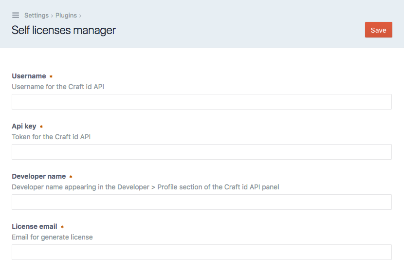

# Self licenses manager plugin for Craft CMS 3.x

Plugin for plugins developer that auto-generate license for their own plugin. No more needs to call the Craftnet API to receive a license and have to manually fill the license field for each plugin. This solve the problem for developer who want to use their own licensed plugin in their own project. 

- Before, you had to install the plugin, generate a license with the Craftnet API, go to the plugins settings page, enter the license code.

- Thanks to this plugin, you select the desired plugins and click on the button.

## Requirements

This plugin requires Craft CMS 3.0.0-beta.23 or later.

## Installation

You can install Self licenses manager via the Plugin Store in the Craft AdminCP.

## Configuration

First step you'll need to configure the settings under Settings > Plugins > plugin-license-manager > settings.

Fill the required fields with the informations found on https://id.craftcms.com 

- Username: Account > Settings > Account Settings > Username
- Api key: Developer > Settings > API Token
- Developer name: Developer > Profile > Developer Name
- License email: The email associated with the generated license

On save, theses informations will be validate with the Craftnet API for validation.

## License generation

All the plugins associated with the setting developer name will be listed.

Note : Only registered CraftID plugins that required license will be shown.

To generate a license, turn on the lightswitch for the selected plugins and click on Generate button.

Each plugins selected will fetch a license with the Craftnet API and the license will be auto-register with theses plugins.

## Credits

- Icon Generator by lastspark from the Noun Project

Brought to you by [KFFEIN](http://kffein.com)
